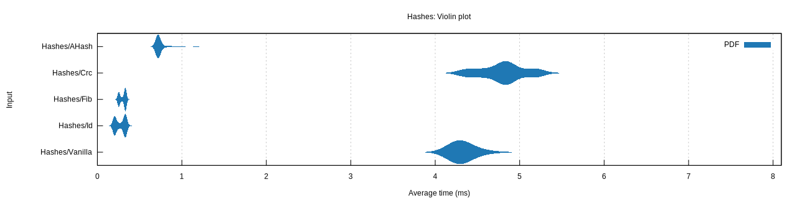
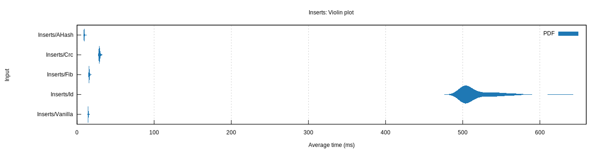
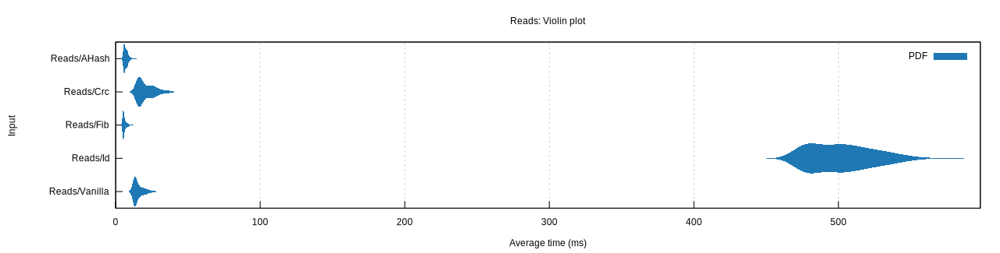

# Fun with Hashes

A quick experiment I did to familiarize myself with the Criterion crate for benchmarking Rust code.

## Why even doing this? Context?

I worked on a voxel game in Unreal, and the team noticed very bad performance of our
`TMap<FVoxelChunkIndex, FSomeData>` data structures. We inserted in those maps a bunch of data once at startup, then we
were only reading from it.

The way we inserted the pairs was by traversing the voxel chunk grid from -X to +X limits, then -Y to +Y, then -Z to +Z.

For fast comparison and fast hashing, we provided our own TypeHash, which cleverly packed the 3
`int32` coordinates into a single `uint64`. Indeed, our world had finite bounds such that we didn't need the full 32
bits of each coordinate. We packed the coordinates values so that the first few MSBs would represent the Z coordinate,
then the Y coordinate, and finally the X coordinate in the LSBs.

Problem is... Unreal's `TMap` will use the identity function for `uint64` keys. So, if the target backing array has a
finite size N, each key `k` is mapped to a slot in this array by doing `k % N`. Uh oh. The `%` operation is discarding
some of the MSBs... So we're going to have a lot of collisions along the Z dimension!

This actually lead us to unoptimized reads (which were our most common operation on this map). Indeed, for a given
(X, Y) chunk coordinates, most if not all chunk coordinates in the Z column would map to the same slot!

In the end, we fixed it by just refactoring our `TypeHash` function to shuffle the encoded `uint64`, rather than use it
directly as key (using a CRC variant). Even with the cost of the introduced shuffling, this drastically improved our
reads on the map. So I wanted to test more of this, with various transform functions on `uint64` I could make to study
this problem and its solutions in more depth.

## What is benchmarked?

Rust HashMaps can be customized at instantiation to tell which hashing function they should use. I used this versatility
to quickly implement a bunch of hashers, and run a few benchmarks for each of them:

- Lots of just hashing
- Lots of insertion in a HashMap
- Lots of reads in a HashMap

The hashers I compared to one another are:

- Identity function (no hashing - key is inserted in the HashMap _as is_)
- "Vanilla" (default Rust HashMap hasher, that uses a default `RandomState`)
- AHash (using the AHash 0.8.8 crate)
- CRC (using the default crc32fast 1.4.2 crate)
- Fibonacci (a function that distributes arbitrary values as evenly as possible into a given range whose size is a power
  of 2)
    - Here is
      the [source article](https://probablydance.com/2018/06/16/fibonacci-hashing-the-optimization-that-the-world-forgot-or-a-better-alternative-to-integer-modulo/)
      describing the technique

## Results

You can see by yourself by cloning this repository then running `cargo bench`. Results will be in
`target/criterion/report/index.html`.

For all benchmarks, I use the same input array of coordinate triplets. It is built as
follows:

```rust
const XY_LOW: i32 = -100;
const XY_UP: i32 = 100;
const Z_LOW: i32 = -10;
const Z_UP: i32 = 10;
const NUM_ELEMS: usize = ((XY_UP - XY_LOW) * (XY_UP - XY_LOW) * (Z_UP - Z_LOW)) as usize;

pub fn gen_coords() -> Vec<VoxelChunkIndex> {
    let mut coords = Vec::<VoxelChunkIndex>::with_capacity(NUM_ELEMS);
    for x in XY_LOW..XY_UP {
        for y in XY_LOW..XY_UP {
            for z in Z_LOW..Z_UP {
                coords.push(VoxelChunkIndex::from_coords(x, y, z));
            }
        }
    }

    coords
}
```

This ends up creating an input of 200 * 200 * 20 = 800 000 coordinates.

The results in this repository were made from my own machine (Win 11, 11th Gen Intel(R) Core(TM) i7-11700K @ 3.60GHz).
The conclusion should however be the same on all machines.

### Hashing function cost

This is the function that is going to be called every time you want to do an insert or a read based on a key at hand.
It is therefore very important that it is as fast as possible, without compromising too much on the spread it procures
for the target slot index.

```
-- Criterion output --
Hashes/Vanilla          time:   [4.3631 ms 4.4056 ms 4.4546 ms]
Hashes/Crc              time:   [4.7781 ms 4.8097 ms 4.8423 ms]
Hashes/Fib              time:   [296.98 µs 301.29 µs 305.52 µs]
Hashes/AHash            time:   [739.93 µs 748.68 µs 758.33 µs]
Hashes/Id               time:   [266.89 µs 273.54 µs 280.23 µs]
```



Of course, the identity function is the fastest, because it does nothing. Fibonacci is also ultrafast, as it's just a
multiplication followed by a shift.

`ahash` is also performing not bad at all, but still around 2x slower than Fibonacci and Id.

`RandomState` however (the vanilla hasher for Rust) is quite slow, and has a big standard deviation (sometimes is quite
fast, sometimes much slower). We are talking roughly 14x slower than Fib! Imagine inserting or reading lots of elements
on a default HashMap... a big part of the cost is _just_ about the bytes-to-slot-index transformation :(

`CRC`, as expected, is also very slow (16x slower than Fib).

### Insertion cost

To insert in a map, 2 things must happen: call the hashing function to find a slot index from the u64 key, then do the
necessary map alteration to store the value associated with the key. If the hashing function is slow
(see section above), you already have a flat cost to pay for each insertion. But if your transformation function outputs
badly spread indices, the collisions it will induce will have an additional cost while the map tries to find an empty
spot where to store the value for the collided key.

```
-- Criterion output --
Inserts/Vanilla         time:   [14.588 ms 14.659 ms 14.747 ms]
Inserts/Crc             time:   [29.222 ms 29.363 ms 29.520 ms]
Inserts/Fib             time:   [15.813 ms 15.908 ms 16.021 ms]
Inserts/AHash           time:   [9.4202 ms 9.5073 ms 9.6025 ms]
Inserts/Id              time:   [515.48 ms 518.14 ms 520.91 ms]
```



And here we see how badly the identity function behaves. In Unreal, I explained above why it's so bad because of how
our coordinates are packed in a single `uint64`. I can't explain the real reason why for Rust's SwissTable
implementation the identity function is bad, but it explains why they don't do like Unreal by default for `u64` keys.

If we zoom in onto the left side of the graph, things get interesting again.

`ahash` just outperforms all others being at least 1.5x faster than all; it has good qualities for the Rust's
implementation of hash maps, and was already fast on its own in the previous section.

`RandomState` and `Fib` are very close. Funny enough, despite the high computing cost of `RandomState`, its
transformative qualities are so good for the Rust hash maps that it rivals `Fib`, which was 14x faster to hash!

`CRC`, as expected again, has good qualities too but is slower than everybody else, because of its high flat computing
cost, probably.

### Read cost

To read from a map, 2 things must also happen: call the hashing function to find the slot index from the u64 key, then
resolve any potential collisions to find the value we are indeed interested in. Again, if the hashing function is slow
(see section above), you already have a flat cost to pay for each read. But if your transformation function outputs
badly spread indices, the collisions it will induce will have an additional cost while the map searches for the actual
value from the collided key.

```
-- Criterion output --
Reads/Vanilla           time:   [15.410 ms 15.852 ms 16.313 ms]
Reads/Crc               time:   [20.361 ms 21.061 ms 21.776 ms]
Reads/Fib               time:   [5.9646 ms 6.1257 ms 6.2954 ms]
Reads/AHash             time:   [6.9355 ms 7.1206 ms 7.3186 ms]
Reads/Id                time:   [500.02 ms 502.51 ms 505.07 ms]
```



And again... the identity function. No need to repeat ourselves here, we already know it's bad because it doesn't have
the proper qualities.

Surprisingly, `Fib` is the winner here. And remained the winner at every run I make, so this is not a fluke (at least on
my machine). `ahash` is still a strong contender, and in practice is probably equivalent. I'll still note however that
`ahash` cost _might_ be a bit less predictable and streamlined than `Fib` (which is just a multiplication followed by a
shift, hence why it's gooder on that front).

`RandomState` and `CRC` show their limits again. The flat cost of those functions (and their standard deviation) makes
them just less likeable than `Fib` and `ahash`. They still perform quite well, even though they are 3.5x slower than
`Fib` on average.

## All in all...

It was the first time I actually used _Fibonacci hashing_ in a real hash map where keys are integers. It's madness we
don't talk more about this function. Even outside hashmaps, the ability of being able to map any integer range to a
target power-of-two range is super useful. Like mapping random values like entity IDs to a gray scale [0-255] for debug
visualizations in an ECS game engine. I'd love to try and plug it into Unreal's TMap and see how it improves (or
worsens!) things.

IMHO, for this test, `ahash` is the winner though. It is very fast to compute, and has the best qualities for Rust's
hash maps. Not sure why the default of the standard library is `RandomState`, which is OK but not the "best"? There
must be a reason (I guess so that they didn't have to provide an implementation of `ahash` inside the std library). No
wonder however that `ahash` is what Bevy (a Rust game engine) uses as default for its hash maps. It's just damn good.

I won't even talk of the identity function. I _think_ it was set up for failure already in this problem space, where
the MSBs were lost by the modulo operation (at least in Unreal; not sure if this is what is happening in Rust too),
leading to _tons_ of collisions in my benchmarks. Still, people don't know that's the default. And very clever people
(not me, but my colleagues behind the VoxelChunkIndex idea) were bitten by it. At the very least, Unreal should make it
clear that if you store useful information in the MSBs, you're going to have a bad time with it. So, all in all, sorry
but not sorry. Identity function as a **hidden** default is just bad.